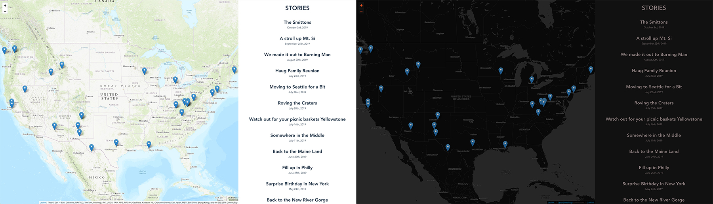

# Together: A Travel Blog

View the blog here: https://together.corylogan.com

Built in Vue.js. Feel free to fork it and use it!

## Features

- Support for light dark mode 🌓
- Pull location data from photos and plot on map 🧭
- Pull date information from photos to categorize in stories 🗓
- Navigate by the map 🗺

## Data Processing

This is a web app that consumes content in a particular shape. I've built a processor that handles all of that called [together-preprocessor](https://github.com/counterbeing/together-preprocessor).
